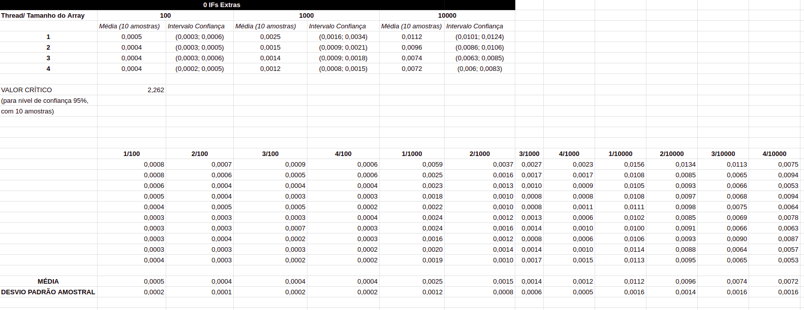
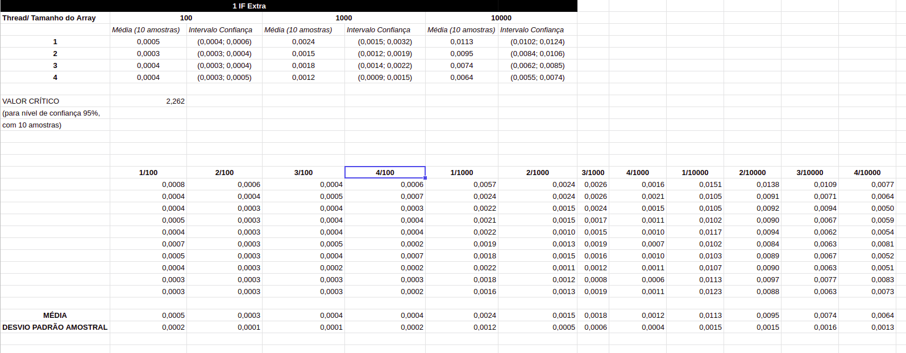
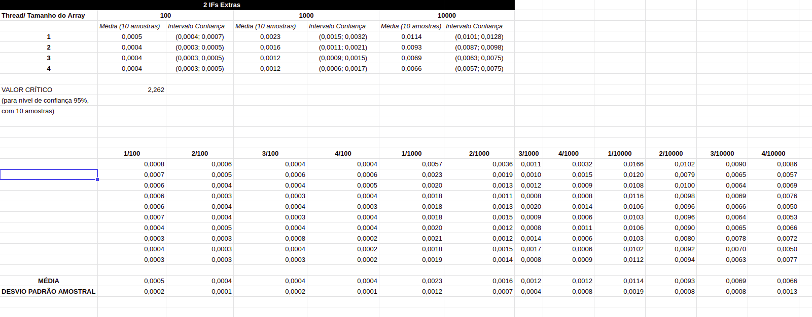
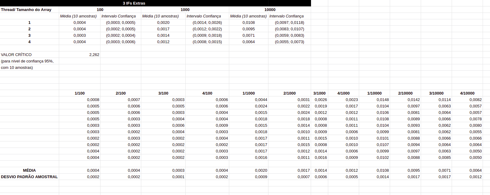

# MAC0219 - MiniEP 01
## Édio Cerati Neto - NUSP 9762678

### Item 01
* Para determinar o Intervalo de Confiança, foi utilizado um nível de confiança de 95%
* O computador utilizado para execução do programa possui um processador i7-4200u, com 4 threads
  
* **Resultado com nenhum IF encadeado extra**
    * 
  
* **Resultado com UM IF encadeado extra**
    * 
  
* **Resultado com DOIS IFs encadeados extras**
    * 
  
* **Resultado com TRÊS IFs encadeados extras**
    * 
  

### Item 02
* De acordo com os resultados obtidos, presentes nas tabelas do Item 01, fica evidente que utilizar todas as threads do processador influencia consideravelmente a rapidez de execução do programa, sendo tal speedup presente em todos os quatro testes, com quantidades de IFs encadeados diferentes
* Considerando a natureza linear do programa, que consiste em percorrer todo um vetor buscando seu máximo, a utilização de todos os 4 threads do processador tem o potencial teórico de até quadruplicar a velocidade de execução. Porém o speedup real foi de cerca de pouco menos do dobro
  
* Outro ponto a se destacar é que a utilização de mais IFs encadeados reduziu progressivamente o tempo de execução. Isso ocorre pois com mais IFs, maior a chance de que uma outra thread que estivesse atualizando o valor do máximo global até esse instante da execução, já o tenha terminado, portanto a thread atual que estivesse passando pelos IFs encadeados não chega a entrar na seção crítica, que ativa a contenção das threads com o mutex, responsável por atrasar a execução

### Item 03
* Mesmo com vários IFs encadeados fora de seção crítica, o IF dentro da seção crítica não pode ser removido para garantir a consistência do programa em encontrar o valor máximo correto do vetor, pois uma outra thread com valor menor já poderia estar aguardando na contenção e vir a atualizar o máximo logo após o valor máximo correto ter sido atualizado pela thread anterior.